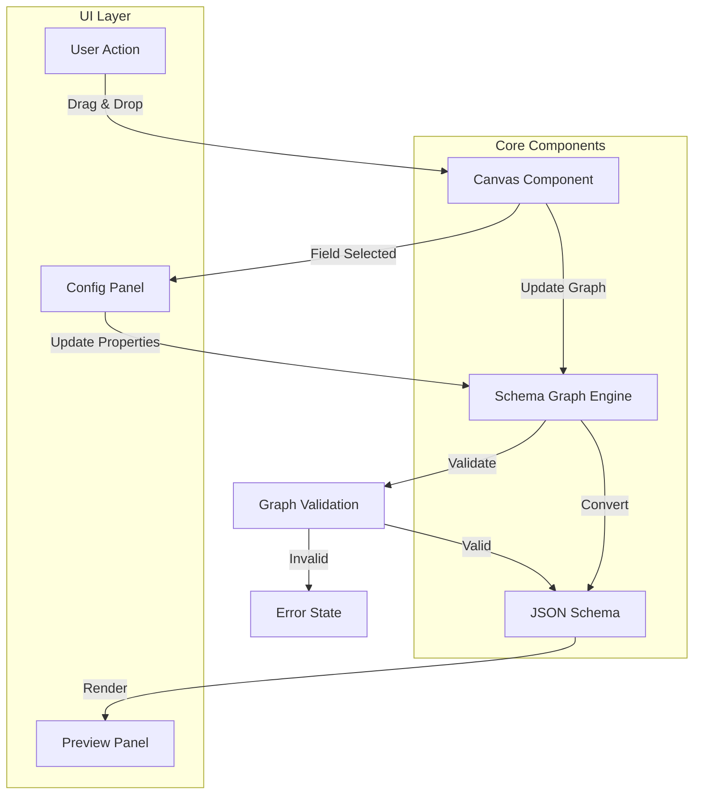
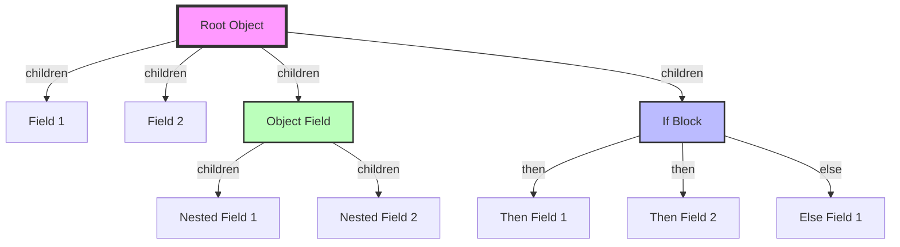
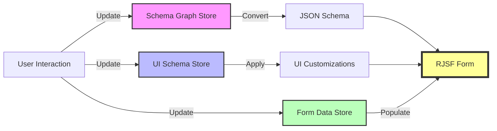

# RJSF Builder Documentation

## Overview

RJSF Builder is a sophisticated form builder application that enables users to create complex forms using JSON Schema as the underlying data format. The application provides a visual drag-and-drop interface for form construction while maintaining the power and flexibility of JSON Schema.

## Core Features

- **Visual Form Building**: Drag-and-drop interface for form construction
- **JSON Schema Based**: Uses JSON Schema as the underlying form definition format
- **Conditional Logic**: Support for IF-THEN-ELSE conditions in forms
- **Rich Validation**: Comprehensive validation rules at field and form levels
- **Modern UI**: Built with Radix UI and Shadcn components
- **Live Preview**: Real-time form preview as you build
- **Custom Widgets**: Support for custom form widgets and field types

## Architecture

### Core Components

1. **Schema Graph Engine**
   - Core logic for managing form structure
   - Converts between visual graph representation and JSON Schema
   - Handles node relationships and validation

2. **Form Builder Components**
   - Canvas: Main form building area
   - Field Palette: Available form elements
   - Field Config Panel: Property configuration
   - Preview Panel: Live form preview

3. **State Management**
   - Schema Graph Store: Form structure and relationships
   - UI Schema Store: Visual customization settings
   - Form Data Store: Form values and state

### Data Flow

The application follows a unidirectional data flow:

1. User interactions in the UI trigger state updates
2. State changes are processed by the Schema Graph Engine
3. Updated schema is converted to JSON Schema format
4. Form is re-rendered with new schema and UI customizations

## Technical Architecture

### Technology Stack

- **Frontend Framework**: React + TypeScript
- **Build Tool**: Vite
- **State Management**: Zustand
- **Form Engine**: React JSON Schema Form (RJSF)
- **UI Components**: Radix UI + Shadcn
- **Drag and Drop**: DND Kit
- **Testing**: Vitest

### Key Concepts

#### Schema Graph

The Schema Graph is the core data structure that represents the form. It consists of:
- Nodes: Form fields and containers
- Relationships: Parent-child relationships between fields
- Properties: Field configurations and validations

#### Field Types

- `string`: Text input fields
- `number`: Numeric input fields
- `boolean`: Checkbox/toggle fields
- `object`: Container for nested fields
- `array`: List of similar fields
- `enum`: Dropdown/radio selection fields
- `if_block`: Conditional logic containers

## Core Logic Flow

Below are visual representations of the core logic flows in the application:

### Form Building Flow

The diagram below illustrates the core form building flow in the application:

This flow diagram shows how:
1. User actions in the UI trigger updates to the canvas
2. The canvas updates the schema graph
3. The schema graph is converted to JSON Schema
4. The preview panel renders the updated form
5. Field selection triggers the config panel
6. All changes go through validation

### Schema Graph Structure

The following diagram shows how the schema graph is structured:

The schema graph structure shows:
- Root object containing all form fields
- Object fields that can contain nested fields
- IF blocks with then/else branches
- Parent-child relationships between fields

### State Management Flow

The state management flow is illustrated below:

This diagram demonstrates:
- Separate stores for schema, UI customizations, and form data
- Conversion of schema graph to JSON Schema
- Application of UI customizations
- Final rendering in the RJSF form component

## Development Guidelines

### Adding New Field Types

To add a new field type:
1. Update the `JSONSchemaType` type in `types.ts`
2. Add validation logic in `field-validators.ts`
3. Create UI components in the form-builder directory
4. Update the field palette to include the new type
5. Add conversion logic in the schema graph engine

### Implementing Validation Rules

Validation rules can be implemented at multiple levels:
1. **Field Level**: Basic type validation and constraints
2. **Graph Level**: Structure and relationship validation
3. **Custom Rules**: Business logic and cross-field validation

### Testing Strategy

The application uses a comprehensive testing approach:
1. **Unit Tests**: For individual components and utilities
2. **Integration Tests**: For form building workflows
3. **Graph Engine Tests**: For schema conversion and validation
4. **UI Tests**: For component interaction and rendering

## Best Practices

### Form Design

1. **Field Organization**
   - Group related fields using object containers
   - Use clear and descriptive field labels
   - Implement conditional logic for complex workflows

2. **Validation**
   - Add appropriate field constraints
   - Implement cross-field validation where needed
   - Provide clear error messages

3. **UI/UX**
   - Maintain consistent field spacing
   - Use appropriate field types for data
   - Implement responsive layouts

### Performance

1. **Schema Graph Operations**
   - Minimize deep cloning operations
   - Cache computed schemas where possible
   - Batch state updates

2. **Rendering**
   - Use memoization for expensive computations
   - Implement virtualization for large forms
   - Lazy load complex components

## Troubleshooting

Common issues and their solutions:

1. **Schema Validation Errors**
   - Check field type compatibility
   - Verify parent-child relationships
   - Ensure required properties are set

2. **UI Update Issues**
   - Verify store updates are triggering
   - Check component memoization
   - Inspect the render cycle

3. **Performance Problems**
   - Profile schema conversions
   - Check for unnecessary rerenders
   - Monitor state update frequency

## Future Enhancements

Planned improvements and features:

1. **Schema Features**
   - Support for more field types
   - Advanced validation patterns
   - Custom widget framework

2. **UI Improvements**
   - Enhanced drag and drop
   - More customization options
   - Improved mobile support

3. **Developer Experience**
   - Better debugging tools
   - Schema migration utilities
   - Enhanced documentation 